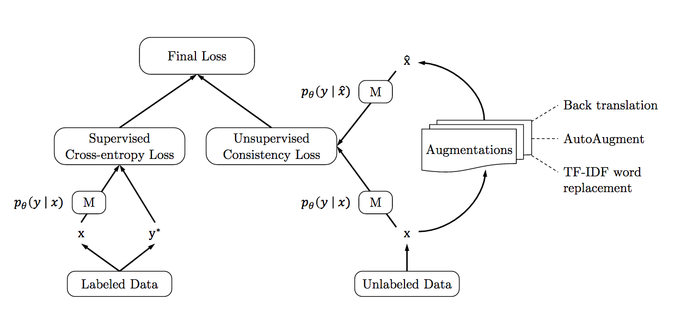

# Unsupervised Data Augmentation experiments in PyTorch

**~~~ /!\ Work in Progress /!\ ~~~**

Experiments with "Unsupervised Data Augmentation" method on Cifar10 dataset.

Based on ["Unsupervised Data Augmentation"](https://arxiv.org/pdf/1904.12848.pdf)

## Unsupervised Data Augmentation in nutshell



## Requirements

All experiments are run using [`mlflow`](https://github.com/mlflow/mlflow), please install the latest version of this library
```
pip install --upgrade mlflow
```

## Experiments

### Start MLFlow UI server

Please create output folder (e.g. `$PWD/output`) and setup mlflow server:

```
export OUTPUT_PATH=/path/to/output
```
and 
```
mlflow server --backend-store-uri $OUTPUT_PATH/mlruns --default-artifact-root $OUTPUT_PATH/mlruns -p 5566 -h 0.0.0.0
```

MLflow dashboard is available in the browser at [0.0.0.0:5566](0.0.0.0:5566)

### CIFAR10 dataset

Create once "CIFAR10" experiment
```
export MLFLOW_TRACKING_URI=$OUTPUT_PATH/mlruns
mlflow experiments create -n CIFAR10
```

Implementation details:
- Models
  - FastResnet inspired from [cifar10-fast repository](https://github.com/davidcpage/cifar10-fast)
  - Wide-ResNet 28-2 from [Wide-ResNet repository](https://github.com/szagoruyko/wide-residual-networks/blob/master/pytorch/resnet.py)

- Consistency loss: KL
- Data augs: AutoAugment + Cutout
- Cosine LR decay
- Training Signal Annealing

#### Fast ResNet
Start a single run

```
export MLFLOW_TRACKING_URI=$OUTPUT_PATH/mlruns

mlflow run experiments/ --experiment-name=CIFAR10 -P dataset=CIFAR10 -P network=fastresnet -P params="data_path=../input/cifar10;num_epochs=100;learning_rate=0.01;batch_size=512;TSA_proba_min=0.5;unlabelled_batch_size=1024"
```

#### Wide ResNet
Start a single run

```
export MLFLOW_TRACKING_URI=$OUTPUT_PATH/mlruns

mlflow run experiments/ --experiment-name=CIFAR10 -P dataset=CIFAR10 -P network=wideresnet -P params="data_path=../input/cifar10;num_epochs=100;learning_rate=0.1;batch_size=512;TSA_proba_min=0.1;unlabelled_batch_size=1024"
```

##### Paper's configuration

```
export MLFLOW_TRACKING_URI=$OUTPUT_PATH/mlruns

mlflow run experiments/ --experiment-name=CIFAR10 -P dataset=CIFAR10 -P network=wideresnet -P params="data_path=../input/cifar10;num_epochs=6250;learning_rate=0.03;batch_size=64;TSA_proba_min=0.1;unlabelled_batch_size=320;"
```

#### Updated version of UDA

```
export MLFLOW_TRACKING_URI=$OUTPUT_PATH/mlruns

mlflow run experiments/ -e main_uda2 --experiment-name=CIFAR10 -P dataset=CIFAR10 -P network=fastresnet -P params="data_path=../input/cifar10;num_epochs=100;learning_rate=0.08;batch_size=512;unlabelled_batch_size=512"
```

### Tensorboard 

All experiments are also logged to the Tensorboard. To visualize the experiments, please install `tensorboard` and run :
```
# tensorboard --logdir=$OUTPUT_PATH/mlruns/<experiment_id>
tensorboard --logdir=$OUTPUT_PATH/mlruns/1
```

## Acknowledgements

In this repository we are using the code from 
- [DeepVoltaire/AutoAugment](https://github.com/DeepVoltaire/AutoAugment) 
- [cifar10-fast repository](https://github.com/davidcpage/cifar10-fast)
- [Wide-ResNet repository](https://github.com/szagoruyko/wide-residual-networks/blob/master/pytorch/resnet.py)

Thanks to the authors for sharing their code!
